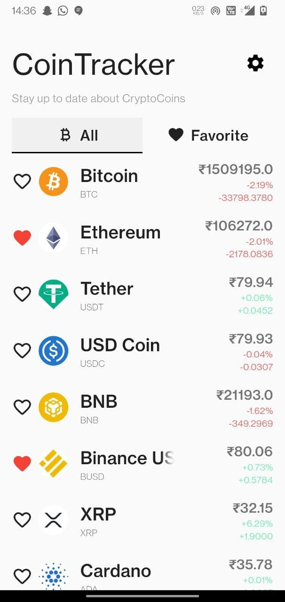
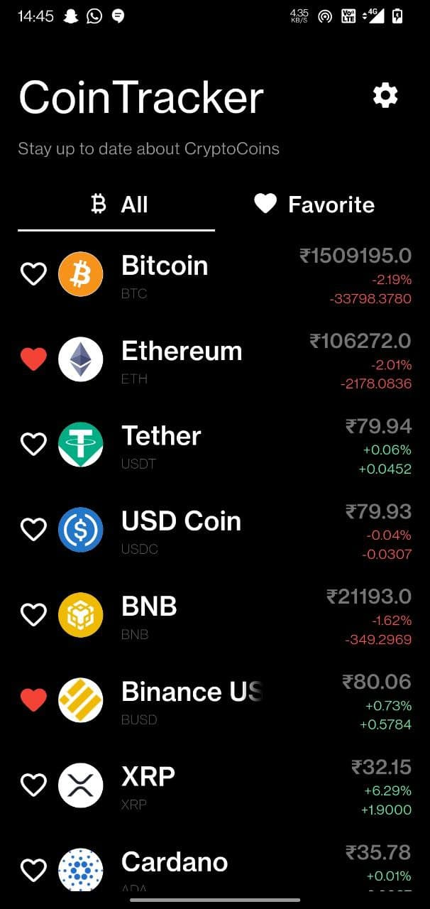
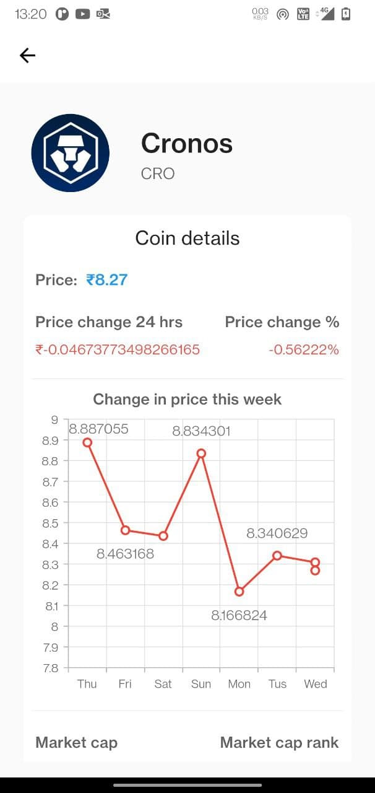
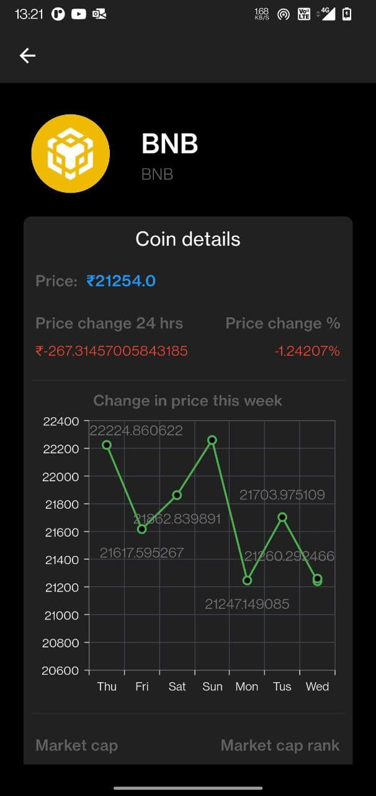
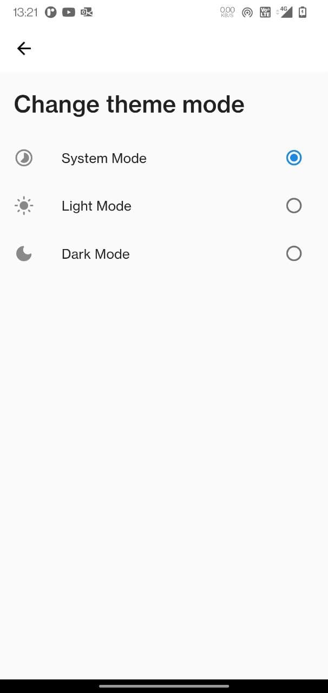

coinTracker
=======================

## A android and ios app which will can help all the crypto investor to find top 50 Cryptocurrency market details from current price to change in price of last week chart and many more.

## Screenshots

### Launcher icon


### Home screen
<div style="display: flex;">


</div>

### Details screen
<div style="display: flex;">


</div>

### Settings and theme page
<div style="display: flex;">


</div>

## Build Setup

``` bash
# install dependencies
flutter pub get.

# run in debug mode
flutter run

# run production build version
flutter run --release

# build production build apk
flutter build apk

# install app in your device
flutter install
```